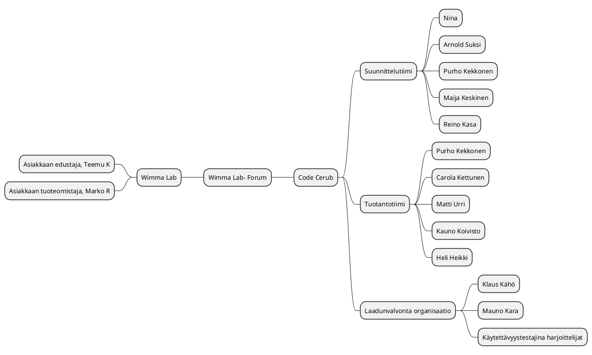

# Projektisuunnitelma

# 1. Toimeksianto

## 1.1 Tausta ja lähtökohdat

[Code Cerub](http://ttc2070te2021s.pages.labranet.jamk.fi/S2021-AB5160/core/10-Projektihallinta/esittely/) on saanut toimeksiannon WIMMA Lab- koulutusympäristöltä. [WIMMA Lab](https://www.wimmalab.org/) on haastekeskeinen oppimiskonsepti, joka toteutetaan virtuaalisesti vuonna 2021. 
Konseptin tarkoituksena on integroida opiskelijoita työnmukaiseen projektityöskentelyyn.Toimeksianto on tuottaa palveluna asiakkaan toiveesta kommunikointia varten ns. Conduit- ohjelmisto pohjaista Foorumi- ratkaisua WIMMA Lab-
kotisivujen osaksi. Lisää ohjelmistovalinnan perusteista [vaatimusmäärittelydokumentissa](http://ttc2070te2021s.pages.labranet.jamk.fi/S2021-AB5160/core/20-Vaatimustenhallinta/vaatimusmaaritely-tiivis/)


Projektin tavoitteena on muokata ja tuottaa Conduit- ohjelmistosta asiakkaan tarpeisiin sopiva versio joka integroituu visuaalisesti hyvin asiakkaan jo olemassa oleviin kotisivuihin sekä tiedon jakamisesssa tarvittavaan linkitykseen sivuilla jo olemassa olevaan materiaaliin.


Projekti toteutetaan Jyväskylän ammattikorkeakoulun informaatioteknologian instituutin järjestämän 
<TTOS2070> ‑opintojakson puitteissa. 


## 1.2 Tavoitteet ja tehtävät

Tavoitteena on muokata ja tuottaa Conduit- ohjelmistosta sopiva versio asiakkaan nykyisiin ja tuntuvasti kasvaviin tarpeisiin niin että palvelun saavutettavuus vastaa EU:n asettamia vaatimuksia. Lisäksi palvelun on oltava saatavilla 24/7 ja SLA:ssa vaatimuksena on 99% käyttöaste, kyberturvallisuuteen panostetaan myös. Näistä lisää [vaatimusmäärittelyissä](http://ttc2070te2021s.pages.labranet.jamk.fi/S2021-AB5160/core/20-Vaatimustenhallinta/vaatimusmaaritely-tiivis/).

_tehtäviä, 
vaihejakoa, 
resursseja 
organisaatiota. 
Vaihejaon yhteydessä on kuvattu jokainen vaihe erikseen lyhyesti.)_


Code Cerub tuottaa ratkaisun Wimma Labin kansainvälistymisen myötä kasvavaan käyttäjämäärään ja asiakas tyytyväisyyden parantamiseen (Forumin kautta Wimma Lab saa itselleen arvokasta tietoa käyttäjiltä ja käyttäjistä itsestään).

 
Toimeksiannossa asiakkaalle luodaan WIMMA Lab- sivustolle lisätoimintona palvelu, Forum, jonka kautta käyttäjät voivat kommentoida asioita. Tätä varten pääsivulle luodaan yksi ylimääräinen button itse Forumille siirtymiseen ja Forumille itselleen erilaisia toimintoja käyttäjien keskustelun mahdollistamaan. Tarkoituksena myös tarjota WIMMA Labille oiva alusta saada tietoa käyttäjistä sekä heiltä nopeaa palautetta. 
Code Cerub myös korjaa WIMMA Lab- palvelun saavutettavuuden EU:n asettamien vaatimuksien tasolle ja samalla nostetaan suorituskykyä varautuen tulevaisuuden kansainvälisen kanssakäynnin aktivoitumiseen. Käyttäjäkunnan arvioidaan kasvavan 5 vuoden aikajänteellä 100 000 henkilöön, alkuun Suomen tasolla käyttäjiä muutama tuhat.
Normaalitilanteessa yhtäaikaisia käyttäjiä uskotaan olevan noin 10 mutta aktiivisessa tilanteessa 150 asiakasta kerrallaan.
Lisääntyneet tietoturvauhat ja palvelun käytön kasvu huomioidaan toteutuksessa vastaamaan Kyberturvallisuus- keskuksen jakamia hyviä käytänteitä.


Projektiin liittyvät sidosryhmät
Projektin toteuttaa Code Cerub, mukana eri työvaiheissa myös harjoittelijoita. 
Johtoryhmään kuuluvat Nina/ Code Cerub, Arkkitehti Carola Kettunen/ Code Cerub, Asiakkaan edustajana tekninen arkkitehti Teemu K sekä Asiakkaan tuoteomistaja Marko Rintamäki 

[Tarvittavaan aineistoon vaatimusmäärittelyssä](http://ttc2070te2021s.pages.labranet.jamk.fi/S2021-AB5160/core/20-Vaatimustenhallinta/vaatimusmaaritely-tiivis/)


## 1.3 Rajaus ja liittymät

Code Cerub vastaa projektin valmistuttua palvelun tukemisesta ja siihen liittyvästä ylläpidosta. Ylläpito ei kuulu projektin tavoitteeseen. 

Asiakas on ilmaissut käyttäjäkunnan kansainvälistymisen lähivuosina ja siksi käyttöliittymässä käytettävät kielitehtäväkokonaisuudet, jotka nyt tehtävään osioon tulevat vielä todennäköisesti jossain vaiheessa liittymään, mutta joita ei tämän projektin puitteissa kuitenkaan tulla toteuttamaan. 

## 1.4 Oikeudet

Osapuolten oikeudet on määritelty [Projektisopimuksessa, Osapuolten oikeudet 4.1, 4.2, 4.3](http://ttc2070te2021s.pages.labranet.jamk.fi/S2021-AB5160/core/10-Projektihallinta/projektisopimus/)

## 1.5 Termit ja määritelmät

Ei erikseen määriteltäviä termejä.

## 1.6 Projektiin liittyvät haasteet

__SWOT- ANALYYSI PROJEKTISTA__

__Strenghts:__ 
* asiakkaan toiveiden kartoittaminen
* toimivan ohjelmiston ensisijaisuus
* tiimin ammattitaito 
* suora viestintä  
* nopea muutoksiin reagointi


__Weaknesses:__ 
* aikaraja (projektin laajuus huomioonottaen ei ole todennäköinen heikkous)

__Opportunities:__ 
* uusien asiakkaiden ja yhteistyökumppaneiden saaminen 
* verkostoituminen

__Threats:__  
* työntekijöiden sairastuminen 
* tietoturvauhat  
* tietotekniset ongelmat

# 2. Projektiorganisaatio


## 2.1 Organisaation esittely

# Code Cerub tiimimme

| Nimi | Vastuualue | Organisaatio | LinkedIn |
| :-: | :-: | :-: | :-: |
| Nina | Projektihallinta ja ohjaus | Code Cerub | [LinkedIn](https://www.linkedin.com/in/ninaleonardi/) |
| Arnold Suksi | Vanhempi projektipäällikkö | Code Cerub | [LinkedIn]() |
| Matti Urri | Ohjelmoija, Frontend | Code Cerub | [LinkedIn]() |
| Kauno Koivisto | Ohjelmoija, Backend | Code Cerub | [LinkedIn]() |
| Heli Heikki | Palvelutuotanto | Code Cerub | [LinkedIn]() |
| Heikki Halipula | Asiakaspalvelu | Code Cerub | [LinkedIn]() |
| Purho "Grapizza" Kekkonen | Graafinen suunnittelu | Code Cerub | [LinkedIn]() |
| Maija Keskinen | Palvelumuotoilu | Code Cerub | [LinkedIn]() |
| Klaus Kähö | Testaus | Code Cerub | [LinkedIn]() |
| Mauno Kara | Tietoturvatestaus | Code Cerub | [LinkedIn]() | 
| Carola "Cake" Kettunen | Arkkitehti / pääohjelmoija | Code Cerub | [LinkedIn]() | 
| Reino "Stackker" Kasa | DevvOps asiantuntija | Code Cerub | [LinkedIn]() |




## 2.2 Vastuut ja päätöksentekoprosessi

**Projektiryhmä**

Projektiryhmän muodostavat Code Cerub työntekijät vastuualueineen.

**Johtoryhmä**

Johtoryhmään kuuluvat tällä hetkellä Code Cerub:n Team leader, yksi ohjelmoija, Asiakas Teemu K. sekä asiakkaan tuoteomistaja Marko R.

**Tukiryhmä**

Tukiryhmä toimii taustatukena ja heitä ovat ohjaava kurssiopettaja sekä kollegat eli toiset ryhmäläiset.
_

## 2.3. Projektin vaiheet ja taloudelliset tavoitteet

_>tehtäväkokonaisuudet, osittelu ja vaiheistus, välitulokset, aikataulut ja resurssissuunnitelmat, budjetti_

## 2.4. Laadun varmistus

_>menetelmät, standardit, hyväksymismenettely, muutosten hallinta, dokumentointi, katselmoinnit, riskien hallinta, muut täydentävät suunnitelmat_

## 2.5. Tiedonvälitys ja projektin etenemisen seuranta

_>projektin aloitus, työtilat ja viestintävälineet, palaverikäytäntö ja yhteydenpito, raportointi ja tiedotus, projektikansio_

## 2.6. Projektin päättyminen

4.12.2021

# 3. Projektin ajalliset tavoitteet	
Forum- keskustelupalsta oltava käytössä viimeistään 3kk kuluttua projektin alkamisesta.


## 3.1 Osittaminen ja vaiheistus

**GANTT PlantUML-muodossa**

```plantuml
Project starts the 2021-8-30
[Projekti aktiivinen] Starts 2021-8-30 and ends 2021-12-4
[Esisuunnittelu] Starts 2021-8-30 and ends 2021-9-6
[Aloitus & suunittelu] Starts 2021-9-6 and ends 2021-10-4
[Toteutusvaihe] Starts 2021-10-4 and ends 2021-11-8
[Tarkistus asiakkaan kanssa] Starts 2021-10-18 and ends 2021-10-22
[Koekäyttö & korjaukset] Starts 2021-11-15 and ends 2021-11-26
[Luovutus ja lopetus] Starts 2021-11-29 and ends 2021-12-4
```


_Projektin sisältämät tavoitteet ja vaiheet (Lyhyt kuvaus kustakin ja mitä tuloksia kustakin syntyy)_

* [Etappi 0](https://gitlab.labranet.jamk.fi/jamkit/project-templates/opf-core-template-v2/-/milestones/2)
Esisuunnittelu 2021.8.30 - 2021.9.6 (X h)
* [Etappi 1](https://gitlab.labranet.jamk.fi/jamkit/project-templates/opf-core-template-v2/-/milestones/3)
Aloitus ja suunnittelu 2021.9.6 - 2021.10.4 (X h)
* [Etappi 2](https://gitlab.labranet.jamk.fi/jamkit/project-templates/opf-core-template-v2/-/milestones/4)
Toteutus alkaa 10.4.2021 (X h)
* [Etappi 3](https://gitlab.labranet.jamk.fi/jamkit/project-templates/opf-core-template-v2/-/milestones/5)
Koekäyttö ja korjaukset 2021.11.15 - 2021.11.26 (X h)
* [Etappi 4](https://gitlab.labranet.jamk.fi/jamkit/project-templates/opf-core-template-v2/-/milestones/6)
Luovutus ja lopetus 2021.11.29 - 2021.12.4 (X h)
* [Etappi 5](https://gitlab.labranet.jamk.fi/jamkit/project-templates/opf-core-template-v2/-/milestones/7)
Palvelu tuotannossa 12.4.2021 (X h)


**Etappi 0**
__Esisuunnittelu 30.8.2021 – 6.9.2021 (X h)__

* Projektisuunnittelu ja suunnitteludokumenttien laatiminen sekä yhteydenpitokäytänteiden luominen toimeksiantajayrityksen kanssa
* Luodaan tuotantoryhmän webbisivut
* Lutustutaan tarkemmin toimeksiantoon
* Aloitetaan kohdealueeseen perehtyminen 
* Laaditaan projektisuunnitelma yhteistyössä toimeksiantajan edustajien kanssa 
* Muodostetaan johtoryhmä
* Pidetään 1. johtoryhmän kokous 
* Allekirjoitetaan projektisopimus.

Vaiheen tuloksia ovat ryhmän imagon (nimi, logo ym.) luominen, webbisivut tms. sekä projektisopimus liitteineen.

**Etappi 1**
__Aloitus ja suunnittelu 6.9.2021 - 20.9.2021 (X h)__
Vaiheen tuloksena.......

**Etappi 2**
__Toteutus alkaa 20.9.2021 (X h)__
Vaiheen tuloksena.......

**Etappi 3**
__Koekäyttö ja korjaukset 2021.11.15 - 2021.11.26 (X h)__

* Palvelu esittely yleisölle ja koekäyttö
* Palautteen kerääminen koekäyttäjiltä


**Etappi 4 Luovutus ja projektin lopetus** 
__Lopetus 29.11.2021 – 4.12.2021 (1 vko)__

* Projektin luovutus ja lopetus, aikaa varattu viikko. 
* Luovutetaan projektin tulos toimeksiantajalle
* Pidetään viimeinen johtoryhmän kokous viikolla X 
* Puretaan projektin organisaatio. 

Lopettamisvaiheen tuloksena laaditaan projektin loppuraportti  ja esitys johtoryhmälle


**Etappi 5**
__Palvelu tuotannossa perjantaina 4.12.2021 (X h)__

Vaiheen tuloksena WIMMA Lab- kotisivut uudella Forum- keskustelupalsta ominaisuudella käytössä.


## 3.2 Projektin alustavat kustannusarvio

Kustannusarvion esittäminen taulukon avulla


<iframe width="402" height="346" frameborder="0" scrolling="no" src="https://jamkstudent.sharepoint.com/sites/OpenProjectPlatform/_layouts/15/Doc.aspx?sourcedoc={ed6e7d24-77a1-4b0a-abf5-e26a48846387}&action=embedview&wdAllowInteractivity=False&wdHideGridlines=True&wdHideHeaders=True&wdDownloadButton=True&wdInConfigurator=True"></iframe>


# 4. Laadunvarmistus
__(kohdan 4 osioihin EI TEHDÄ TÄSSÄ VAIHEESSAN MITÄÄN! Poikkeusena kohdat 4.4 ja 4.6 korjataan)__


Projektissa sovellettavat työmenetelmät, välineet, ohjeet ja standardit

>Tässä kappaleessa luetellaan kaikki käytettävät menetelmät, työkalut ja standardit versionumeroineen. Usein toimeksiantajalla on jokin menetelmä, jota projektiryhmän olisi syytä noudattaa. Toimeksiantaja voi määrittää myös noudatettavat dokumenttien ulkoasustandardit. Muussa tapauksessa projektiryhmä räätälöi IT-instituutin tarjoamista mallipohjista itselleen soveltuvan ja toimeksiantajan hyväksymän mallin.

>Opintojakso asettaa siis tietyt vaatimukset projektin seurantatyökaluille ja raportoinnille, jotka tulee ottaa huomioon. Opintojaksolla ei kuitenkaan pakoteta tiettyä tapaa käyttää työkaluja, joten niiden käytöstä on syytä tehdä suunnitelma tähän kohtaan.

>Projektin tiedon- ja versionhallinnan perusteet tulee selvittää, jotta kaikki projektin sidosryhmät tietävät dokumenttien uusimpien versioiden sijainnin. Projektisuunnitelmasta ja kaikista muistakin projektin keskeisistä dokumenteista tulee useita versioita, joihin pitää lisätä versiohistoria, jotta projektin kehityksen seuraaminen jälkikäteen on mahdollista. Mikäli jokin yksittäinen laite tai ohjelmisto nousee projektin toteutuksen kannalta kriittiseen asemaan, on tälle hyvä nimetä vastuuhenkilö, joka tuntee ko. laitteen tai ohjelmiston ryhmästä parhaiten. Ohessa on lista asioista, jotka kannattaa suunnitella ja dokumentoida: _

## 4.1 Väli- ja lopputulosten hyväksymismenettely

_>Tähän kirjataan se hyväksymismenettely, mikä projektissa on sovittu._

## 4.2 Muutosten hallinta

_>Kuvataan muutosten hallintaproseduuri projektinkäytäntöihin tai projektin tuloksiin liittyvien muutosten osalta._

## 4.3 Dokumentointi

Dokumentit tallennetaan Gitlabiin ja dokumentin mahdollinen vastuuhenkilö on kirjattu erikseen dokumenttiin.

## 4.4 Riskien hallinta

| ID |	Kuvaus | Vakavuus | Todennäköisyys | Kuka vastaa | Mitä toimintaan riskin ilmentyessä? | 
|:--:|:--:|:--:|:--:|:--:|:--:|
| RIS-001 | Ryhmän jäsen sairastuu flunssaan |  V3 | 60 % |[Tiimin jäsen]() | Ilmoitus tiiminvetajalle ja tarvittaesssa toimeksiantajalle. |
| RIS-002 | Sähköt katkeavat kehitystyön aikana | V4 | 10 %  | [Sähköyhtiö]() | Varmistetaan, että kaikilla on käytössään varayhteydet esim. puhelimella. |
| RIS-004 | Rahoitusongelmat | V1 | 10%  | [Asiakas]() | Johtoryhmän kokous ja osapuolten kesken mietitään ratkaisua (kyseessä ei ole iso projekti). |
| RIS-005 | Työntekijä irtisanoutuu | V2 | 10%  | [Johtoryhmä]() | Tehtävään uusi tekijä joko organisaatiosta tai sen ulkopuolelta  |
| RIS-006 | Tietoliikenne ongelmat | V4 | 10%  |  [Palvelun tarjoaja]() | Vikailmoitus palvelun tarjoajalle |
| RIS-007 | Ulkoiset uhat, esim hyökkäys | V2 | 2%  |  [Tietoturvatiimi]() | Korjataan vauriot ja haavoittuvuus |


[Riskienhallintataulukko](https://gitlab.labranet.jamk.fi/ttc2070te2021s/S2021-AB5160/core/-/blob/master/dokumentit/10-Projektihallinta/riskitaulukko.md)

## 4.5 Katselmointikäytäntö

Katselmoinnissa mahdollisesti tarvittavat dokumentit toimitetaan kunkin katselmoinnin aikana osapuolille nähtäväksi

* Projektin etenemisen katselmointi Code Cerub- tiimin sisäisesti joka perjantai kello 12.00
* Lähtötilannekatselmointi projektiorganisaation kanssa
* Alustava aikataulullinen katselmointi, dokumenttien sekä demoversion katselmointi asiakkaan ja projektiorganisaation kanssa
* Toteutuksen aikaansaannoksen välikatselmointi, muutosten ja parannusten huomiointi asiakkaan ja projektiorganisaation kanssa
* Muutosten ja parannusten muokkaus, korjaus ja testaus
* Luovutus ja käyttöönottokatselmointi asiakkaan kanssa

## 4.6 Projektisuunnitelmaa täydentävät suunnitelmat

* [Projektisopimus](https://gitlab.labranet.jamk.fi/ttc2070te2021s/S2021-AB5160/core/-/blob/master/dokumentit/10-Projektihallinta/projektisopimus.md)

* [Vaatimusmäärittely](http://ttc2070te2021s.pages.labranet.jamk.fi/S2021-AB5160/core/20-Vaatimustenhallinta/vaatimusmaaritely-tiivis/)


* [Julkaisusuunnitelma](https://gitlab.labranet.jamk.fi/ttc2070te2021s/S2021-AB5160/core/-/blob/master/dokumentit/40-Julkaisusuunnittelu/julkaisusuunnitelma.md)

* [Yleistestisuunnitelma](https://gitlab.labranet.jamk.fi/ttc2070te2021s/S2021-AB5160/core/-/blob/master/dokumentit/50-Testaushallinta/yleistestaussuunnitelma.md)

* [Viestintäsuunnitelma](https://gitlab.labranet.jamk.fi/ttc2070te2021s/S2021-AB5160/core/-/blob/master/dokumentit/10-Projektihallinta/viestintasuunnitelma.md)

* [Riskihallintasuunnitelma](https://gitlab.labranet.jamk.fi/ttc2070te2021s/S2021-AB5160/core/-/blob/master/dokumentit/10-Projektihallinta/riskitaulukko.md)

* Arkkitehtuurisuunnitelma

## 4.7 Suunnitelmien tarkistus- ja päivitysajankohdat 

Projektin etenemistä seurataan organisaatiossa viikottain mahdollisten muutosten varalta ja muutokset päivitetään ajantasalle projektisuunnitelmaan.

## 4.8 Projektin keskeyttämiskriteerit

Projektisuunnitelmaan kuuluu myös projektin keskeyttämiskriteerit soveltaen erillistä sopimusta, ks. projektisopimuksen kohta 17 Sopimuksen päättäminen. Tätä ei kuitenkaan opiskelijaprojekteissa käytetä, koska projekteissa käytetään tietty tuntimäärä tuloksen tekoon ja tulos luovutetaan sellaisena, kun se opintojakson päättyessä on. Projektiryhmä tekee kuitenkin jatkokehityssuunnitelman, josta mahdollinen uusi projekti jatkaa.

# 5. Tiedonvälitys ja projektin etenemisen seuranta (viestintäsuunnitelma)

## 5.1 Viestintäsuunnitelma

Viestinnässä hyödynnetään pääsääntöisesti etäyhteyksiä Microsoft Teams avulla sekä projektin omaa Gitlab repositoriota, jossa tärkeimmät dokumentit saatavilla. Asiakastapaamisissa sovelletaan toistaiseksi Zoom -videoviestintäsovellusta. Viestinnästä vastaa projektin viesintävastaava yhteistyössä Team leaderin kanssa.
-Viestintäkanavia: Teams, Gitlab, Zoom
-Palavereja: Suunnittelu maanantaisin kello 10.00, Daily joka aamu kello 8.15, ohjaus, katselmointi perjantaisin kello 12.00
Code Cerub- viestintäsuunnitelma

[Viestintäsuunnitelma](https://gitlab.labranet.jamk.fi/ttc2070te2021s/S2021-AB5160/core/-/blob/master/dokumentit/10-Projektihallinta/viestintasuunnitelma.md)


# 6. Projektin päättyminen

## 6.1 Lopputuotteen luovutus, käyttöönotto

Lopputuote luovutetaan asiakkaalle projektin virallisen päättymisen yhteydessä, jolloin otetaan huomioon tarvittavat asennusohjeet ja käyttöönottokoulutus palvelulle.
Projektisuunnitelmaan liitetään myös asennussuunnitelma ja käyttöönottosuunnitelma asiakasta varten.

## 6.2 Projektin tuottaman aineiston taltiointi, arkistointi ja säilytysaika

Tuotettu dokumentaatio projektista säilyvät toistaiseksi myös projektin loputtua. Mahdollisista dokumenttien jatkotaltioinnista sovitaan erikseen. Katso kohta 6.5 Loppuraportti

## 6.3 Projektin virallinen päättäminen


_>On tärkeää määritellä milloin, mihin tai miten projekti päättyy. Projektin päätös voi olla tietty päivämäärä, tietty tuotteen valmiusaste, tietty työtuntimäärä, tietty kulutettu rahasumma, kun asiakas ottaa tuotteen käyttöön, takuuaika on umpeutunut tai kun asiakas hyväksyy tuotteen._

Projekti päättyy 22.11.2021, jolloin projektisopimuksen voimassaoloaika päättyy.
## 6.4 Lopetusilaisuus 

>Yleensä projektit päätetään yhteiseen päätösseminaariin. Tähän kirjataan osallistujat ja ajankohta. 
* Saunailta :)? oltava ISSUE ja henkilöt kutsuttu sinne!!


## 6.5 Projektin loppuraportti

>Projektin loppuraportti laaditaan viimeiseen johtoryhmän kokoukseen mennessä.

