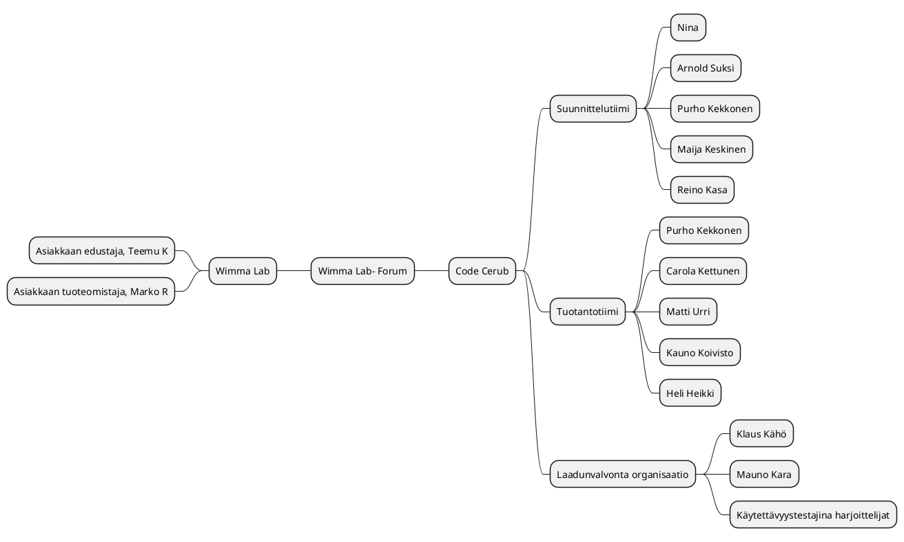

# Projektisuunnitelma

## 1. Toimeksianto 


## 1.1 Tausta ja lähtökohdat

Core Cerub on saanut toimeksiannon WIMMA Lab- koulutusympäristöltä. Toimeksianto on tuottaa palveluna asiakkaan toiveesta ns. Conduit- ohjelmisto pohjaista Foorumi- ratkaisua [WIMMA Lab-](https://www.wimmalab.org/)
kotisivujen osaksi. Lisää ohjelmistovalinnan perusteista [vaatimusmäärittelydokumentissa](http://ttc2070te2021s.pages.labranet.jamk.fi/S2021-AB5160/core/20-Vaatimustenhallinta/vaatimusmaaritely-tiivis/)


Projektin tavoitteena on muokata ja tuottaa Conduit- ohjelmistosta asiakkaan tarpeisiin sopiva versio joka integroituu visuaalisesti hyvin asiakkaan jo olemassa oleviin kotisivuihin sekä tiedon jakamisesssa tarvittavaan linkitykseen sivuilla jo olemassa olevaan materiaaliin.


Projekti toteutetaan Jyväskylän ammattikorkeakoulun informaatioteknologian instituutin järjestämän 
<TTOS2070> ‑opintojakson puitteissa. 


## 1.2 Tavoitteet ja tehtävät

Tavoitteena on muokata ja tuottaa Conduit- ohjelmistosta sopiva versio asiakkaan nykyisiin ja tuntuvasti kasvaviin tarpeisiin niin että palvelun saavutettavuus vastaa EU:n asettamia vaatimuksia. Lisäksi palvelun on oltava saatavilla 24/7 ja SLA:ssa vaatimuksena on 99% käyttöaste, kyberturvallisuuteen panostetaan myös. Näistä lisää * [vaatimusmäärittelyissä](http://ttc2070te2021s.pages.labranet.jamk.fi/S2021-AB5160/core/20-Vaatimustenhallinta/vaatimusmaaritely-tiivis/)

_tehtäviä, 
vaihejakoa, 
resursseja 
organisaatiota. 
Vaihejaon yhteydessä on kuvattu jokainen vaihe erikseen lyhyesti.)_


Code Cerub tuottaa ratkaisun Wimma Labin kansainvälistymisen myötä kasvavaan käyttäjämäärään ja asiakas tyytyväisyyden parantamiseen (Forumin kautta Wimma Lab saa itselleen arvokasta tietoa käyttäjiltä ja käyttäjistä itsestään).

_>(Liitä lähteeksi vaatimusmäärittelyn sisältöä
> Määritä työn keskeisin sisältö; projektin tehtävä liittyy projektin kohteessa kuvattuun kokonaisuuteen.)_


* Mitä aiotaan tehdä? 

_> (Mitä toimintaa aiotaan kehittää ja miten?>
> Visio tulevasta tilasta
> Mikä on tuotettava lopputulos (konkreettinen)?
> Mitkä ovat osa- tai välitulokset?>)_

* projektiin liittyvät sidosryhmät
Projektin toteuttaa Code Cerub, mukana eri työvaiheissa myös harjoittelijoita. 
Johtoryhmään kuuluvat Nina/ Code Cerub, Arkkitehti Carola Kettunen/ Code Cerub, Asiakkaan edustajana tekninen arkkitehti Teemu K sekä Asiakkaan tuoteomistaja Marko Rintamäki 

* [Linkki tarvittavaan aineistoon vaatimusmäärittelyssä](http://ttc2070te2021s.pages.labranet.jamk.fi/S2021-AB5160/core/20-Vaatimustenhallinta/vaatimusmaaritely-tiivis/)


## 1.3 Rajaus ja liittymät

Code Cerub vastaa projektin valmistuttua palvelun tukemisesta ja siihen liittyvästä ylläpidosta. Ylläpito ei kuulu projektin tavoitteeseen. 

Asiakas on ilmaissut käyttäjäkunnan kansainvälistymisen lähivuosina ja siksi käyttöliittymässä käytettävät kielitehtäväkokonaisuudet, jotka nyt tehtävään osioon tulevat vielä todennäköisesti jossain vaiheessa liittymään, mutta joita ei tämän projektin puitteissa kuitenkaan tulla toteuttamaan. 

## 1.4 Oikeudet

Osapuolten oikeudet on määritelty [Projektisopimuksessa, Osapuolten oikeudet 4.1, 4.2, 4.3](http://ttc2070te2021s.pages.labranet.jamk.fi/S2021-AB5160/core/10-Projektihallinta/projektisopimus/)

## 1.5 Termit ja määritelmät

Ei erikseen määriteltäviä termejä.

## 1.6 Projektiin liittyvät haasteet

Projektille on määrätty tiukka kolmen kuukauden aikaraja ja ohjelmisto muutoksineen on oltava asiakkaan käytössä viimeistään 3kk projektin alkamisesta. Omat rajansa asettaa asiakkaan ennalta valitsema Conduit- ohjelmisto, tämä tosin ei vaikuta projektin valmistumiseen ajallisesti.

_>Tarkastellaan projektin tavoitteita ja laaditaan tueksi SWOT-kuvaus, jossa tarkastellaan koko projektia ja sen toimintaympäristöä._


# 2. Projektiorganisaatio

Organisaatiossa ovat Code Cerub henkilöstö, Harjoittelijat Wilma Wimman, Edit Files ja Ron Aldo. Asiakkaan edustajana Teemu K sekä Asiakkaan tuoteomistaja Marko R.


## 2.1 Organisaation esittely

Code Cerub WIMMA Lab Forum- Projekti organisaatioon kuuluu Code Cerub organisaation henkilökunta ja harjoittelijat Wilma Wimman, Edit Files sekä Ron Aldo.
Code Cerub- harjoittelijat ovat jo suorittaneet opintonsa ja ovat nyt neljän kuukauden palkattomalla koeajalla jonka aikana he toimivat osana teknistä tiimiä monipuolisissa ICT- alan tehtävissä. Koeajan jälkeen harjoittelijat siirtyvät vuoden mittaiseen palkalliseen harjoittelujaksoon vuoden 2022 loppuun. Töitä koeajalla tehdään pääsääntöisesti toimistoaikoina, mutta toisinaan myös iltaisin ja viikonloppuisin.
Harjoittelijat olivat estyneitä kuvaus päivänä ja siksi heitä ei tiimi kuvassa ole.

## Code Cerub tiimimme

| Nimi | Tehtävä | Työnantaja | LinkedIn |
| : - : | : - : | : - : | : - : |
| Nina | Projektihallinta ja ohjaus | Code Cerub | [LinkedIn]() 
| Arnold Suksi | Vanhempi projektipäällikkö | Code Cerub | [LinkedIn]() 
| Matti Urri | Ohjelmoija, Frontend | Code Cerub | [LinkedIn]() 
| Kauno Koivisto | Ohjelmoija, Backend | Code Cerub | [LinkedIn]() 
| Heli Heikki | Palvelutuotanto | Code Cerub | [LinkedIn]() 
| Heikki Halipula | Asiakaspalvelu | Code Cerub | [LinkedIn]()
| Purho "Grapizza" Kekkonen | Graafinen suunnittelu | Code Cerub | [LinkedIn]() 
| Maija Keskinen | Palvelumuotoilu | Code Cerub | [LinkedIn]() 
| Klaus Kähö | Testaus | Code Cerub | [LinkedIn]() 
| Mauno Kara | Tietoturvatestaus | Code Cerub | [LinkedIn]() 
| Carola "Cake" Kettunen | Arkkitehti / pääohjelmoija | Code Cerub | [LinkedIn]() 
| Reino "Stackker" Kasa | DevvOps asiantuntija | Code Cerub | [LinkedIn]()




## 2.2 Vastuut ja päätöksentekoprosessi

_>(**2.2 EI TEHDÄ TÄSSÄ VAIHEESSAN MITÄÄN)**Tähän kirjataan kaikkien projektiorganisaatioon kuuluvien (esim. johtoryhmä, projektipäällikkö, sihteeri, ryhmä, >ohjaajat) vastuut sekä päätöksentekoprosessi (esim. projektipäällikkö valmistelee ja esittää johtoryhmän päätettäväksi…)

**Projektiryhmä**

>”Projektiryhmä suorittaa johtoryhmän projektille asettamat tehtävät käytettävissä olevien resurssien puitteissa. >Projektin aikana ryhmän päällikön ja sihteerin roolit kiertävät ryhmän sisällä siten, että jokainen ryhmän jäsen toimii >kerran kummassakin roolissa.”

**Johtoryhmä**

>”Johtoryhmän muodostavat siihen valitut projektiryhmän, ohjaajien ja toimeksiantajan edustajat. Johtoryhmän kokouksiin >voidaan tarvittaessa kutsua myös muita henkilöitä, esim. asiantuntijoita. Johtoryhmän kokoonpano on esitelty >projektisopimuksen liitteessä <X>.” 

**Tukiryhmä**

>Tukiryhmän tehtävänä on antaa projektiryhmälle sisällöllistä opastusta tehtävän suorittamiseksi. Kappaleessa tulee >esitellä projektin muut sidosryhmät (asiakas, ulkopuoliset konsultit, jne.) henkilötasolla. Asiakkaan mukana olevista >henkilöistä tulee mainita ainakin nimi, yhteystiedot, toimenkuva sekä rooli projektissa.
_

## 2.3. Projektin vaiheet ja taloudelliset tavoitteet

_>tehtäväkokonaisuudet, osittelu ja vaiheistus, välitulokset, aikataulut ja resurssissuunnitelmat, budjetti_

## 2.4. Laadun varmistus

_>menetelmät, standardit, hyväksymismenettely, muutosten hallinta, dokumentointi, katselmoinnit, riskien hallinta, muut täydentävät suunnitelmat_

## 2.5. Tiedonvälitys ja projektin etenemisen seuranta

_>projektin aloitus, työtilat ja viestintävälineet, palaverikäytäntö ja yhteydenpito, raportointi ja tiedotus, projektikansio_

## 2.6. Projektin päättyminen

___luovutus, käyttöönotto, ylläpito, projektin aineiston taltiointi, arkistointi, loppuraportti, projektin virallinen päättäminen___

# 3. Projektin ajalliset tavoitteet	
Forum- keskustelupalsta oltava käytössä viimeistään 3kk kuluttua projektin alkamisesta.


## 3.1 Osittaminen ja vaiheistus


_>Projektin etenemistä voidaan kuvata ns. GANTT-kaaviolla. Sen avulla voidaan esittää eri vaiheiden eteneminen aikajanalla, samalla voidaan osoittaa eri tehtäviin liittyvät kriittiset pisteet._

**GANTT PlantUML-muodossa**

```plantuml
Project starts the 2021-5-15
[Projekti aktiivinen] Starts 2021-5-15 and ends 2021-8-15 
[Määrittely vaihe] Starts 2021-5-15 and ends 2021-5-20
[Suunittelu] Starts 2021-5-20 and ends 2021-6-5
[Toteutus+suunnittelu] Starts 2021-6-5 and ends 2021-7-15
[Testaus+korjaus] Starts 2021-7-16 and ends 2021-8-1
[Hyväksyntätestaus] Starts 2021-8-1 and ends 2021-8-10
[Luovutus] Starts 2021-8-10 and ends 2021-8-15
```

_> Projektin osittamisella tarkoitetaan projektin jakamista selkeisiin osakokonaisuuksiin ja niitä vastaaviin toteutuskokonaisuuksiin (osaprojekteihin, vaiheisiin, tehtäväkokonaisuuksiin ja tehtäviin). > > Tutkimus- ja kehitysprojektien etenemiselle on tyypillistä lopputuloksen muodostuminen ja tavoitteen tarkentuminen vaihe vaiheelta. Projektin osituksen tulee perustua tähän lähtökohtaan (koskee myös > > IT-instituutin opiskelijaprojekteja). 
>Projektin elinkaari voidaan jakaa erityyppisiin vaiheisiin. Kussakin vaiheessa tuotetaan määrätyt tuotteet, kuten selvitys, suunnitelmat, prototyyppi, laite jne. Kunkin vaiheen loppuun sovitaan arviointi, hyväksyntä tai katselmointi. Ohjelmistoprojekti jakautuu tyypillisesti seitsemään vaiheeseen: perustaminen, esitutkimus, analyysi, suunnittelu, toteutus, testaus ja lopettaminen. Joskus esitutkimus on oma projektinsa, joskus analyysi sisällytetään suunnitteluun jne. Testaus ei välttämättä ole oma vaiheensa, vaan se sisältyy kaikkiin vaiheisiin. Usein edetään inkrementaalisesti eli ensin suunnitellaan ja toteutetaan yksi asia kokonaisuudessaan ennen kuin edetään seuraavaan asiakokonaisuuteen. Ei ole yhtä ainutta ”oikeaa” vaihejakoa, mutta jos toimeksiantajalla on oma menetelmänsä ja siihen liittyvät mallipohjat, niin opiskelijaprojekteissa käytetään ensisijaisesti niitä. Yhä useammin käytetään ketterää sovelluskehitystä eli ohjelmisto tehdään 1-4 viikon sprinteissä._


>Projektin sisältämät tavoitteet ja vaiheet (Lyhyt kuvaus kustakin ja mitä tuloksia kustakin syntyy)> 

* [Etappi 0](https://gitlab.labranet.jamk.fi/jamkit/project-templates/opf-core-template-v2/-/milestones/2)
* [Etappi 1](https://gitlab.labranet.jamk.fi/jamkit/project-templates/opf-core-template-v2/-/milestones/3)
* [Etappi 2](https://gitlab.labranet.jamk.fi/jamkit/project-templates/opf-core-template-v2/-/milestones/4)
* [Etappi 3](https://gitlab.labranet.jamk.fi/jamkit/project-templates/opf-core-template-v2/-/milestones/5)
* [Etappi 4](https://gitlab.labranet.jamk.fi/jamkit/project-templates/opf-core-template-v2/-/milestones/6)
* [Etappi 5](https://gitlab.labranet.jamk.fi/jamkit/project-templates/opf-core-template-v2/-/milestones/7)


_(Opettaja: Jokainen vaihe, niiden vaatimat aikaresurssit ja tulokset läpi lyhyesti. Vaiheet ja niiden tehtävät kuvataan tarkemmin vaihesuunnitelmissa. Parhaillaan meneillään olevasta vaiheesta tulee olla tiedossa tarkasti kuka tekee ja kuinka paljon työtä tämän vaiheen tehtävien suorittamiseksi. Myöhempien vaiheiden työmääräarviot voidaan esittää alkuvaiheessa karkealla tasolla, jota sitten projektin edetessä tarkennetaan yksityiskohtaiselle tasolle. Tämä tapahtuu jokaisen vaiheen lopussa, jolloin suunnitellaan tarkemmin seuraava vaihe.
Huom.: Seuraavassa on esitetty käynnistys- ja lopetusvaiheet. Kaikista projektin vaiheista, niiden kestoista ja työmääristä laaditaan myös nk. Gantt-kaavio (liitteenä), jossa näkyy myös vaiheiden väliset riippuvuudet ja tärkeimmät etapit (esim. johtoryhmän kokouspäivämäärät).)_


**Etappi 0**
__Esisuunnittelu 30.8.2021 – 6.9.2021 (X h)__

Projektin käynnistämiseen kuuluu olennaisesti projektisuunnittelu ja suunnitteludokumenttien laatiminen sekä yhteydenpitokäytänteiden luominen toimeksiantajayrityksen kanssa. Vaiheen aikana tehdään
> esim. ryhmän webbisivut, tutustutaan tarkemmin toimeksiantoon, aloitetaan kohdealueeseen perehtyminen ja laaditaan projektisuunnitelma yhteistyössä toimeksiantajan edustajien kanssa. Vaiheen aikana
> muodostetaan johtoryhmä, pidetään 1. johtoryhmän kokous sekä allekirjoitetaan projektisopimus.
>”Vaiheen tuloksia ovat ryhmän imagon (nimi, logo ym.) luominen, webbisivut tms. sekä projektisopimus liitteineen.

**Etappi 1**
__Aloitus ja suunnittelu 6.9.2021 - 20.9.2021 (X h)__
Vaiheen tuloksena.......

**Etappi 2**
__Toteutus alkaa 20.9.2021 (X h)__
Vaiheen tuloksena.......

**Etappi 3**
__Tarkistukset ja korjaukset alkaa 27.9.2021 (X h)__

Tarkistukset ja korjaukset sisällytetään projektin 3kk aikajanalle niin, että tarkistukset tehdään joka toinen maanantai projektin alusta aina lokakuun loppuun saakka. Ensimmäinen Tarkistus ja korjaus 27.9.2021 ja siitä eteenpäin ma 27.9.2021, ma 11.10.2021 ja ma 25.10.2021, näin projektin suunta on koko ajan oikea ja tiimi työskentelee yhdessä. 
Tarkistusten määrä lisätty koska projektissa on useita harjottelijoita ja täten budjetissa on väljyyttä ja laadun varmistaminen useammin on mahdollista, tärkeä myös harjoittelijat huomioonottaen (opetus).


**Etappi 4 Luovutus ja projektin lopetus 12.11.2021** 
__Lopetus 12.11.2021 – 19.11.2021 (X h)__

>Projektin luovutus ja lopetus, aikaa varattu viikko. Laaditaan projektin loppuraportti (lopettamisvaiheen tuloksena) ja esitys johtoryhmälle. Luovutetaan projektin tulos toimeksiantajalle, pidetään viimeinen johtoryhmän kokous viikolla X sekä puretaan projektin organisaatio. 

 Palvelu tuotannossa perjantaina 19.11.2021. 3kk määräaika umpeutuu maanantaina 22.11.2021. 

**Etappi 5**
__Palvelu tuotannossa 19.11.2021 (X h)__
WIMMA Lab- kotisivut uudella Forum- keskustelupalsta ominaisuudella käytössä.


## 3.2 Projektin alustavat kustannusarvio

_Kustannusarvion esittäminen taulukon avulla: _


<iframe width="402" height="346" frameborder="0" scrolling="no" src="https://jamkstudent.sharepoint.com/sites/OpenProjectPlatform/_layouts/15/Doc.aspx?sourcedoc={ed6e7d24-77a1-4b0a-abf5-e26a48846387}&action=embedview&wdAllowInteractivity=False&wdHideGridlines=True&wdHideHeaders=True&wdDownloadButton=True&wdInConfigurator=True"></iframe>


# 4. Laadunvarmistus

_>Projektissa sovellettavat työmenetelmät, välineet, ohjeet ja standardit

>Tässä kappaleessa luetellaan kaikki käytettävät menetelmät, työkalut ja standardit versionumeroineen. Usein toimeksiantajalla on jokin menetelmä, jota projektiryhmän olisi syytä noudattaa. Toimeksiantaja voi määrittää myös noudatettavat dokumenttien ulkoasustandardit. Muussa tapauksessa projektiryhmä räätälöi IT-instituutin tarjoamista mallipohjista itselleen soveltuvan ja toimeksiantajan hyväksymän mallin.

>Opintojakso asettaa siis tietyt vaatimukset projektin seurantatyökaluille ja raportoinnille, jotka tulee ottaa huomioon. Opintojaksolla ei kuitenkaan pakoteta tiettyä tapaa käyttää työkaluja, joten niiden käytöstä on syytä tehdä suunnitelma tähän kohtaan.

>Projektin tiedon- ja versionhallinnan perusteet tulee selvittää, jotta kaikki projektin sidosryhmät tietävät dokumenttien uusimpien versioiden sijainnin. Projektisuunnitelmasta ja kaikista muistakin projektin keskeisistä dokumenteista tulee useita versioita, joihin pitää lisätä versiohistoria, jotta projektin kehityksen seuraaminen jälkikäteen on mahdollista. Mikäli jokin yksittäinen laite tai ohjelmisto nousee projektin toteutuksen kannalta kriittiseen asemaan, on tälle hyvä nimetä vastuuhenkilö, joka tuntee ko. laitteen tai ohjelmiston ryhmästä parhaiten. Ohessa on lista asioista, jotka kannattaa suunnitella ja dokumentoida: _

## 4.1 Väli- ja lopputulosten hyväksymismenettely

_>Tähän kirjataan se hyväksymismenettely, mikä projektissa on sovittu._

## 4.2 Muutosten hallinta

_>Kuvataan muutosten hallintaproseduuri projektinkäytäntöihin tai projektin tuloksiin liittyvien muutosten osalta._

## 4.3 Dokumentointi

_>Kirjataan minne dokumentit tallennetaan/arkistoidaan, miten ne jaetaan ja kuka on vastuussa eri dokumenteista._

## 4.4 Riskien hallinta

_>Listataan riskit, arvioidaan niiden vakavuus ja todennäköisyys ja koetetaan miettiä toimenpiteet kuinka vakavimmat/todennäköisimmät riskit voitaisiin ehkäistä jo ennalta. Lisäksi olisi hyvä olla suunnitelma kuinka toimitaan, jos riski toteutuu._


_> Kirjataan alla olevaan taulukkoon projektiin kohdistuvat riskit ja pidetään niitä yllä tarpeen mukaan. Jokaiselle riskille annetaan yksilöllinen tunniste esim. RIS007, koska tämä helpottaa niiden käsittelyä eri tilanteissa._

| ID |	Kuvaus | Vakavuus | Todennäköisyys | Kuka vastaa | Mitä toimintaan riskin ilmentyessä? | 
|:--:|:--:|:--:|:--:|:--:|:--:|
| RIS-001 | Ryhmän jäsen sairastuu flunssaan |  V3 | 60 % |[Tiimin jäsen 1]() | Ilmoita [tiiminvetajalle]() ja tarvittaesssa [toimeksiantajalle](). |
| RIS-002 | Sähköt katkeavat kehitystyön aikana | V5 | 10 %  | [Tiimin jäsen 2]() | Varmistetaan, että kaikilla on käytössään varayhteydet esim. puhelimella |
| RIS-003 | ... | ... | ...  | ... |

[Riskienhallintataulukko](https://gitlab.labranet.jamk.fi/ttc2070te2021s/S2021-AB5160/core/-/blob/master/dokumentit/10-Projektihallinta/riskitaulukko.md)

## 4.5 Katselmointikäytäntö

_>Luetellaan ja alustavasti aikataulutetaan projektin tuloskatselmukset laaditun toteutussuunnitelman pohjalta. Esitetään luettelomaisesti, mitä katselmuksia pidetään, alustava ajankohta, käsiteltävät asiat, osallistujat sekä käytännöt katselmointimateriaalin toimittamisesta (mitä, milloin, miten)._

## 4.6 Projektisuunnitelmaa täydentävät suunnitelmat

* [Projektisopimus](https://gitlab.labranet.jamk.fi/ttc2070te2021s/S2021-AB5160/core/-/blob/master/dokumentit/10-Projektihallinta/projektisopimus.md)

* [Vaatimusmäärittely](http://ttc2070te2021s.pages.labranet.jamk.fi/S2021-AB5160/core/20-Vaatimustenhallinta/vaatimusmaaritely-tiivis/)


* [Julkaisusuunnitelma](https://gitlab.labranet.jamk.fi/ttc2070te2021s/S2021-AB5160/core/-/blob/master/dokumentit/40-Julkaisusuunnittelu/julkaisusuunnitelma.md)

* [Yleistestisuunnitelma](https://gitlab.labranet.jamk.fi/ttc2070te2021s/S2021-AB5160/core/-/blob/master/dokumentit/50-Testaushallinta/yleistestaussuunnitelma.md)

* [Viestintäsuunnitelma](https://gitlab.labranet.jamk.fi/ttc2070te2021s/S2021-AB5160/core/-/blob/master/dokumentit/10-Projektihallinta/viestintasuunnitelma.md)

* [Riskihallintasuunnitelma](https://gitlab.labranet.jamk.fi/ttc2070te2021s/S2021-AB5160/core/-/blob/master/dokumentit/10-Projektihallinta/riskitaulukko.md)


## 4.7 Suunnitelmien tarkistus- ja päivitysajankohdat 

_>Projektisuunnitelman avulla reagoidaan poikkeamiin ja ympäristömuutoksiin, joten sitä päivitetään projektin aikana. Tähän kohtaan kirjataan ne ajankohdat, jolloin suunnitelman ajantasaisuus ainakin on tarkistettava._

## 4.8 Projektin keskeyttämiskriteerit

_Oikeaoppiseen projektisuunnitelmaan kuuluu myös projektin keskeyttämiskriteerit. Näitä ei kuitenkaan opiskelijaprojekteissa käytetä, koska projekteissa käytetään tietty tuntimäärä tuloksen tekoon ja tulos luovutetaan sellaisena, kun se opintojakson päättyessä on. Projektiryhmä tekee kuitenkin jatkokehityssuunnitelman, josta mahdollinen uusi projekti jatkaa._

# 5. Tiedonvälitys ja projektin etenemisen seuranta (viestintäsuunnitelma)

## 5.1 Viestintäsuunnitelma

[Viestintäsuunnitelma](https://gitlab.labranet.jamk.fi/ttc2070te2021s/S2021-AB5160/core/-/blob/master/dokumentit/10-Projektihallinta/viestintasuunnitelma.md)

_>Listaa projektissa sovitut työtilat ja viestintävälineet, palaverikäytäntö ja yhteydenpito, raportointi ja tiedotus._

# 6. Projektin päättyminen

## 6.1 Lopputuotteen luovutus, käyttöönotto


_>Projektin lopputuote tulee myös dokumentoida järkevällä tasolla. Osana lopputuotetta saattaa olla asiakkaalle tarjottavaa käyttöönottokoulutusta ja mahdollisesti asennus- tai käyttöönotto­palvelua. Mikäli koulutuksen rooli projektin kannalta on huomattava (esimerkiksi ohjelmiston käyttäjät eivät ole olleet mukana projektissa ja eivät tiedä miten järjestelmä toimii) tulee projektisuunnitelmaan liittää suunnitelma asiakkaalle tarjottavasta koulutuksesta. Lisäksi jos on tarpeen, tulee projektisuunnitelmaan liittää myös asennussuunnitelma ja käyttöönottosuunnitelma._

## 6.2 Projektin tuottaman aineiston taltiointi, arkistointi ja säilytysaika

_>”Projektiryhmien dokumentaatiosta jäävä osa tallennetaan X-järjestelmään” 
>Toimeksiantajan kanssa tulee tarvittaessa voida sopia, mitkä dokumentit voidaan jättää opiksi seuraaville projekteille. 
>Tyypillisesti eri suunnitelmat ja loppuraportti sopivin osin ovat tällaisia dokumentteja. _

## 6.3 Projektin virallinen päättäminen


_>On tärkeää määritellä milloin, mihin tai miten projekti päättyy. Projektin päätös voi olla tietty päivämäärä, tietty tuotteen valmiusaste, tietty työtuntimäärä, tietty kulutettu rahasumma, kun asiakas ottaa tuotteen käyttöön, takuuaika on umpeutunut tai kun asiakas hyväksyy tuotteen._

Projekti päättyy 22.11.2021, jolloin projektisopimuksen voimassaoloaika päättyy.

## 6.4 Lopetustilaisuus

>Yleensä projektit päätetään yhteiseen päätösseminaariin. Tähän kirjataan osallistujat ja ajankohta. 

* Saunailta :)?


## 6.5 Projektin loppuraportti

>Projektin loppuraportti laaditaan viimeiseen johtoryhmän kokoukseen mennessä.

