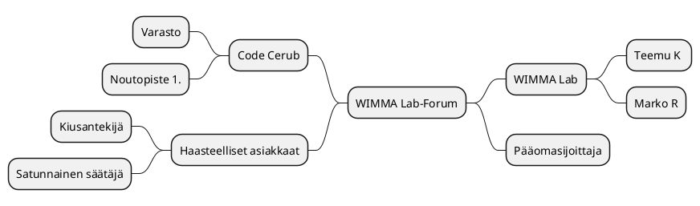
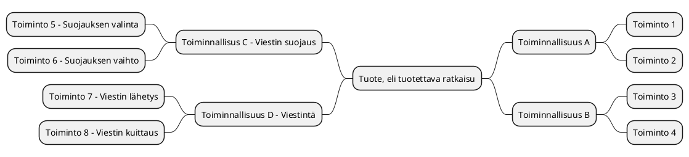

# Tiivistetty vaatimusmäärittely

* [WIMMA Lab- Forum] 
* Projektimäärittely/vaatimusmäärittelyn tiivistetty versio v 0.3 4.1.2021 (NarsuMan)


## Johdanto


Projektin tavoitteena on muokata ja tuottaa Conduit- ohjelmistosta asiakkaan tarpeisiin sopiva versio joka integroituu visuaalisesti hyvin asiakkaan jo olemassa oleviin kotisivuihin sekä tiedon jakamisesssa tarvittavaan linkitykseen sivuilla jo olemassa olevaan materiaaliin.


Projekti toteutetaan Jyväskylän ammattikorkeakoulun informaatioteknologian instituutin järjestämän 
<TTOS2070> ‑opintojakson puitteissa. 

## Tavoitteet 
Tavoitteena on muokata ja tuottaa Conduit- ohjelmistosta sopiva versio asiakkaan nykyisiin ja tuntuvasti kasvaviin tarpeisiin niin että palvelun saavutettavuus vastaa EU:n asettamia vaatimuksia. Lisäksi palvelun on oltava saatavilla 24/7 ja SLA:ssa vaatimuksena on 99% käyttöaste, kyberturvallisuuteen panostetaan myös. Näistä lisää [laajassa vaatimusmäärittelyssä](http://ttc2070te2021s.pages.labranet.jamk.fi/S2021-AB5160/core/20-Vaatimustenhallinta/vaatimusmaarittely-laaja/).

Code Cerub tuottaa ratkaisun Wimma Labin kansainvälistymisen myötä kasvavaan käyttäjämäärään ja asiakas tyytyväisyyden parantamiseen (Forumin kautta Wimma Lab saa itselleen arvokasta tietoa käyttäjiltä ja käyttäjistä itsestään).

 
Toimeksiannossa asiakkaalle luodaan WIMMA Lab- sivustolle lisätoimintona palvelu, Forum, jonka kautta käyttäjät voivat kommentoida asioita. Tätä varten pääsivulle luodaan yksi ylimääräinen button itse Forumille siirtymiseen ja Forumille itselleen erilaisia toimintoja käyttäjien keskustelun mahdollistamaan. Tarkoituksena myös tarjota WIMMA Labille oiva alusta saada tietoa käyttäjistä sekä heiltä nopeaa palautetta. 
Code Cerub myös korjaa WIMMA Lab- palvelun saavutettavuuden EU:n asettamien vaatimuksien tasolle ja samalla nostetaan suorituskykyä varautuen tulevaisuuden kansainvälisen kanssakäynnin aktivoitumiseen. Käyttäjäkunnan arvioidaan kasvavan 5 vuoden aikajänteellä 100 000 henkilöön, alkuun Suomen tasolla käyttäjiä muutama tuhat.
Normaalitilanteessa yhtäaikaisia käyttäjiä uskotaan olevan noin 10 mutta aktiivisessa tilanteessa 150 asiakasta kerrallaan.
Lisääntyneet tietoturvauhat ja palvelun käytön kasvu huomioidaan toteutuksessa vastaamaan Kyberturvallisuus- keskuksen jakamia hyviä käytänteitä.


## Kohderyhmä

Millaisia ovat sen käyttäjät? Mikä tuotoksen tavoite on eri sidosryhmien kannalta? 
Kannattaa nostaa esiin lyhyesti mahdolliset loppukäyttäjä ja oleellisiin palvelusta hyötyviin sidosryhmät

## Sidosryhmäkartta


>Mietitään tarkemmin millaisia käyttäjä/sidosryhmiä liittyy suunniteltuun ratkaisuun/ohjelmistoon/palvelukokonaisuuteen? 
Näitä selkeyttääksemme kirjataan kaikki sidosryhmät sidosryhmäkartan muotoon. Nostetaan samalla esiin mikä on 
ko. sidosryhmän/edustajan palveluun liittyvä motivaatio. Kuvauksen voi laatia esim. piirtämällä, MindMap-muodossa tai soveltaen sopivaa UML-notaatiota.

> Voit tutustu nyt aiemmin mainittuun PlantUML-työkaluun ja kokeilla luoda sidosryhmäkartta käyttäen (http://plantuml.com/)
> Huomaa! PlantUML-lohkon määrittelyssä käytetään Gitlab-ympäristössä eri avainsanoja @startuml/@enduml- rivien sijaan  



**Tarkennettut sidosryhmäprofiilit** 


> Kuvataan tarkemmin sidosryhmäkartasssa esiteltyhä sidosryhmiä/profiileja. Tarvittaessa kuvataan tarkemmin valitut sidosryhmät ja tarkennetaan niitä, jos toimeksianto sitä edellyttää. Tähän sovelletaan alisivuja, joita tarpeen mukaan kopioidaan "pohjat"-kansiosta Katso esim. **Asiakas B**

| ID | Tyyppi | Nimi | Piirteet |  Motivaatio |
|:-:|:-:|:-:|:-:|:-:|
| SR-001 | Sidosryhmä/Profiili | Asiakas A | Nuori 16-22V | Selkeä tarve palvelulle ja tarvitsee palvelua usein |
| SR-002 | Sidosryhmä/Profiili | [Asiakas B - Profiili 1 ](pohjat/pohja-profiilikuvaus.md) | "Aikuinen" 22-45V | Tarve satunnainen, mutta yleisin asiakas  |
| SR-003 | Sidosryhmä/Profiili | Rahoittaja | Pääomasijoittaja | Palvelun tuottamat tuotot |
| SR-004 | Sidosryhmä/Profiili | Verottaja | Nuori karhu | Kerätä verotuloja  |

## Palveluun liittyviä asiakaspolkuja

```plantuml
Step1: Käyttäjä WIMMA Lab- etusivulla 
Step2: Käyttäjä valitsee "Forum" välilehden  
Step3: Käyttäjä on reksteröitynyt ja valitsee "Sign-in" 
Step4: Käyttäjä syöttää "Username" ja "Password"
Step5: Käyttäjä painaa "OK"- painiketta
Step6: Käyttäjä WIMMA Lab- Forumilla
Step7: Käyttäjä ei ole rekisteröitynyt palveluun ja valitsee "Create account"
Step8: Käyttäjä luo käyttäjätilin
Step9: Käyttäjälle lähtee vahvistusviesti sähköpostiin
Step10: Käyttäjä vahvistaa rekisteröitymisen ja siirtyy kirjautuneena palveluun
Step11: Käyttäjä lukee/julkaisee/kommentoi Forumilla

[*] --> Step1
Step1 --> Step2
Step2 --> Step3
Step2 --> Step7
Step3 --> Step4
Step7 --> Step8
Step4 --> Step5
Step8 --> Step9
Step5 --> Step6 
Step9 --> Step10
Step10 --> Step6
Step6 --> Step11
```

### Käyttöliittymänäkymä/mockup 


> Jos projektin tuloksena tuo sähköinen ratkaisu, on sen konkretisoimiseksi hyvä hyödyntää esimerkiksi MockUp-kuvaa.
Tähän kannattaa liittää tarvittaessa kuvausta kuvan/mockup-näkymän muodossa. Se helpottaa ymmärtämään tarvittaessa oleellisesti tavoiteltua ratkaisua. 

```plantuml
salt
{
  Just plain text
  [This is my button]
  ()  Unchecked radio
  (X) Checked radio
  []  Unchecked box
  [X] Checked box
  "Enter text here   "
  ^This is a droplist^
}
```


## Tärkeimmät toiminnallisuudet/ominaisuudet


> Hahmotellaan tähän kohtaan ominaisuudet pelkästään ranskalaisilla viivoilla ja MindMap-kuvauksen avulla. Eli mitä tavoitellulla ratkaisulla/palvelulla mielestäsi on mahdollista tehdä? 
> Mieti tilannetta, kun joku kysyy sinulta mitä palvelulla voi tehdä? Saat aikaa vastata 15 sekuntia. Mitä vastaat ja mitkä toiminnot nostatat esiin ehdottomasti valtteina verrattuna muihin vastaaviin ratkaisuihin/palveluihin?
> Tässä kohtaa kannattaa tarkistaa mitä olivat asiakkaan esittämät toiveet palvelusta? Niistä voisi löytyä ehkä joitain tässä vaiheessa?


- Oleelliset toiminnot (Esimerkkejä) 
    - Asiakas_A voi lähettää postia toiselle henkilölle
    - Asiakas_A voi saada tietoa aiemmin tehdyistä valinnoista
    - Ylläpito-henkilö voi poistaa laskun Asiakaalta
    - Ylläpito-henkilö voi luoda uuden laskun Asiakkaalle 
    - Asiakas_A voi soittaa tuntemalleen kaverille
    - Asiakas_B voi jakaa kuvan
    - Asiakas_B kykenee tallettamaan tilanteen
    - Asiakas_B voi liittää Asiakkaan_A ryhmään uuden henkilön
    - etc..





## Alustavat käyttäjätarinat


> Ketterän kehityksen myötä on yleistynyt tapa kuvata asiakkaan tarpeita ns. käyttötarinoiden (User Story) muodossa. Kirjataan tähän ennalta tunnistetut käyttötarinat. Tutustu aiheeseen [User Story](https://en.wikipedia.org/wiki/User_story)

| ID | Tyyppi | Kuvaus | Linkki |
|:-:|:-:|:-:|:-:|
| US-001 | Käyttäjätarina | Esim. Käyttäjänä haluan, että voin luoda raportin tekemistäni ostoista viimeisen kuukauden ajalta, koska se helpottaa oman talouteni hallintaa | #1 |
| US-002 | Käyttäjätarina | Esim. Käyttäjänä haluan, että voin poistaa historian tekemistäni ostoista viimeisen kuukauden ajalta, koska en halua muistella menneitä | #2 |

## Yleiset tekniset vaatimukset

> Teknisiä ratkaisuja määriteltäessa on hyvä tunnistaa tarvittavat teknologiat, laitteistot tai muut tarvittavat fyysiset ratkaisut. 
Ohjelmiostoratkaisuja määriteltäessä kannattaa erottaa puhtaasti tekniset/tuotannolliset vaatimukset ja kirjata ne vaatimusmäärittelyyn esimerkiksi teknisinä vaatimuksina. 

| ID | Tyyppi | Kuvaus | 
|:-:|:-:|:-:|
| HWREQ-0002 | Tekniset vaatimukset | Palvelun tärkeimpien palvelujen on oltava vähintään kahdennettu N+1 | |
| HWREQ-0003 | Tekniset vaatimukset | Palvelimen muistikapasiteeti >32GB  ||
| HWREQ-0005 | Tekniset vaatimukset | Palvelimen fyysinen sijainti on oltava EU-aluella| |
| HWREQ-0005 | ... | ... ||

# Toiminnalliset vaatimukset (Functional Requirements)

>Mitä toimintoja palveluun liittyy? Nämä kannattaa kirjata ensi ns. toiminnallisina vaatimuksina? Toiminnallisilla vaatimuksilla kuvataan ohjelmistolta/järjestelmältä vaadittuja toimintoja.
Toiminnalliset vaatimukset ovat helpoimmin tunnistettavia. Vältä useamman vaatimuksen kirjaamista samaan lauseeseen! Jokainen vaatimus erikseen.

| ID | Tyyppi | Kuvaus | Toiminnallisuus johon vaatimus vaikuttaa |								
|:-:|:-:|:-:|:-:|
| FUNCREQ-C0001 | Toiminnallinen vaatimus | Krjautumiseen voi käyttää Facebook-tunnuksia | [Toiminnallisuus X](pohjat/pohja-ominaisuus.md) |
| FUNCREQ-C0002 | Toiminnallinen vaatimus | Käyttöliittymää voidaan ohjata äänikomennoilla | [Toiminnallisuus Y](pohjat/pohja-ominaisuus.md) |
| FUNCREQ-C0003 | Toiminnallinen vaatimus | ... | ... |

# Laadulliset eli ei-toiminnalliset vaatimukset

>Mitä olivat ei-toiminnalliset vaatimukset? Voit esittää eri vaatimuksia erillisessä taulukossa tai viitata tässä [yhteen](pohjat/pohja-vaatimuslistalle.md) laajempaan taulukkoon.
[Ei-toiminnalliset vaatimukset](https://en.wikipedia.org/wiki/Non-functional_requirement) sisältää laajan joukko eri näkökulmia sähköiseen palveluun liittyen. Tärkeimmät kirjoittajan 
näkökulmasta ovat seuraavat: Suorituskyky, tietoturva ja saavutettavuus 

* Suorituskyky
* Tietoturva
* Saavutettavuus

## Suorituskykyyn liittyvät vaatimukset


>Millaisia vaatimuksia palveluun kohdistuu suorituskyvyn näkökulmasta?

| ID | Tyyppi | Kuvaus |
|:-:|:-:|:-:|
| PERFREQ-0000 | Suorituskyky | Kirjautuminen on mahdollista yhtäaikaa 100 käyttäjällä (100 request/s) |					
| PERFREQ-0001 | Suorituskyky | Palvelun maksimi käyttäjä määrä on ? |
| PERFREQ-0002 | Suorituskyky | ... ||

## Tietoturvan vaatimukset


>Millaisia vaatimuksia palveluun kohdistuu tietoturvan näkökulmasta? Tutustu samalla [VAHTI ohjeistukseen](https://vm.fi/documents/10623/360844/K%C3%A4sikirjan+liite+Tietoturvavaatimukset/56b3fb8f-bb54-4a65-a37f-79f6985d868c)

| ID | Tyyppi | Kuvaus | Miten testataan? |
|:-:|:-:|:-:|:-:|
| SECURITY-REQ-0001 | Salasanassa on käytettävä vähintään MD5-tason salausta, koska [CONSTRAIN-000]() sitä edellyttää | [Testitapaus X]() |
| SECURITY-REQ-0002 | Jokainen tapahtuma palvelussa on kirjattava käyttölogiin, että niitä voidaan tarkastella myöhemmin | [Testitapaus Y]() |
| SECURITY-REQ-0003 | ... | ... |

## Saavutettavuuden vaatimukset


>Mitä tarkoitetaan saavutettavuudella? Millaisia asioita/ohjeistuksia on otettava huomioon palvelua toteutettaessa?
Tutustu [saavutettavuusdirektiiviin](https://saavutettavuusdirektiivi.fi/saavutettavuus-verkkopalveluissa/) ja kirjaa  

| ID  | Luokka | Kuvaus | Miten testataan? |
|:-:|:-:|:-:|:-:|
| AVAILREQ-0000 | Saavutettavuus | | [Testit]() |	
| AVAILREQ-0001 | Saavutettavuus | | [Testit]() |
| AVAILREQ-0002 | Saavutettavuus | ... | ... |

### Toimeksiannon kannalta tärkeät oleelliset rajaukset

> Eri ohjelmistojena/palvelujen toteutusta ja käyttöä ohjaavat usein lait ja säädökset. Näiden edellyttämät vaatimukset voidaan kirjataan tarvittaessa vaatimusmäärittelyyn.
Rajausten vaikutus koskee usein palvelun jonkin osa-kokonaisuuden toteuttamista. Tästä syystä eri rajoitteet on tunnistettava ajoissa, koska vaikutus 
saataa olla varsin ratkaiseva pitemmällä tähtäimella. Esimerkkinä tästä on viime vuonna voimaan tullut [EU GDPR-säädös](https://en.wikipedia.org/wiki/General_Data_Protection_Regulation).
> Kannattaa tutkia esimerkiksi https://www.sfs.fi/aihealueet/terveydenhuolto/laakinnalliset_laitteet tai http://docs.jhs-suositukset.fi/jhs-suositukset/JHS190/JHS190.html

| ID | Tyyppi | kategoria | Vastuullinen |
|:-:|:-:|:-:|:-:|
| CONSTRAIN-000  | Rajaus | Palvelun kirjautumisprosessin on noudatettava JUHTA-hyväksyttyjä käytänteitä  | [Kirjautuminen ft1](pohjat/pohja-ominaisuus.md) |
| CONSTRAIN-001 | Rajaus | On huomioitava Standardi ZZZ osana palvelun tapahtuma login talletusta | [Log-palvelin](pohjat/pohja-ominaisuus.md)|
| CONSTRAIN-002 | Rajaus | ... | ... |

### Palvelun tuotantoympäristö

> Vaatimusmäärittelyn tukena sovelletaan erilaisia kuvauksia, joista esimerkkinä UML-kuvauskieleen liittyvä sijoittelu näkymä, eli "Deployment Diagram", kuvauksen avulla voi esittää miten palvelu on tarkoitus toteuttaa käytännössä. Missä sijaitsevat eri osat palvelusta ja miten eri osat on kytketty toisiinsa.


## Palveluun liittyvät muut järjestelmät

Alla olevat kuvaukset ovat esimerkkejä UML-kuvauksen mahdollisuuksista, kannattaa tutustua tarkemmin laajempaan vaatimusmäärittely pohjaan,  koska siitä löytyy esimerkkejä.

> Järjestelmien välisiä yhteyksiä voidaan kuvata tarvittaessa esim. UML-kuvauksiin liittyvän sekvenssikaavion muodossa (Sequence Diagram). 

```plantuml
Client_Host --> Service_Frontend: Login Request
Service_Frontend --> Service_Backend : Logging request check
Service_Backend --> MariaDB : SQL Request for user account
MariaDB --> Service_Backend : Account and password 
Service_Backend --> Service_Frontend : Request Result pass
Service_Frontend --> Client_Host : Logged in

```
## Standardit ja lähteet

> Vaatimusmäärittelyyn kannattaa liittää mukaan kaikki tärkeät lähteet, joista on hyötyä tai merkitystä kokonaisuuden kannalta. Standardit ja ennalta jaetut ohjeistukset ovat hyödyllisiä lähteitä ja tarvittaessa tukevat esitettyjä vaatimuksia.

| ID | Nimi | Linkki | Kuvaus |  
|:-:|:-:|:-:|:-:|
| REF1 | JHS 165 ICT | [JHS Suositukset - vaatimusmäärittelylle](http://www.jhs-suositukset.fi/c/document_library/get_file?uuid=b8118ad7-8ee4-459a-a12b-f56655e4ab9d&groupId=14) | Vaatimusmäärittelyn suositus |
| REF2 | ISO 9241-11  | [Käytettävyys](https://fi.wikipedia.org/wiki/K%C3%A4ytett%C3%A4vyys)  | Usability | 
| REF3 |  EN 301 549 | [Saavutettavuus](https://fi.wikipedia.org/wiki/Saavutettavuus) | Availability |
| REF4 |  GDPR | [GDPR Asetus](https://europa.eu/youreurope/business/dealing-with-customers/data-protection/data-protection-gdpr/index_fi.htm) | General_Data_Protection_Regulation |
